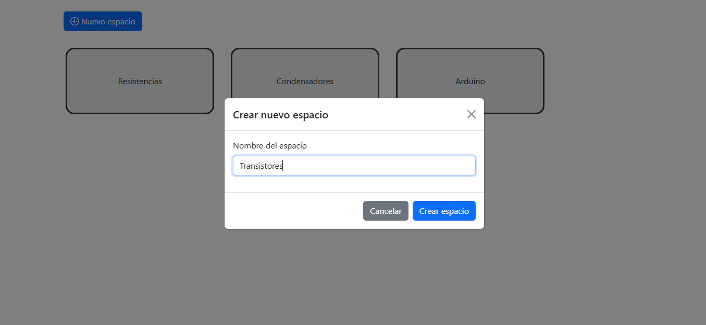
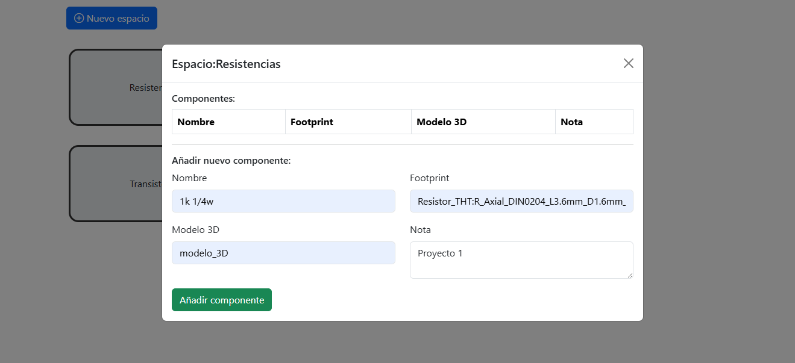
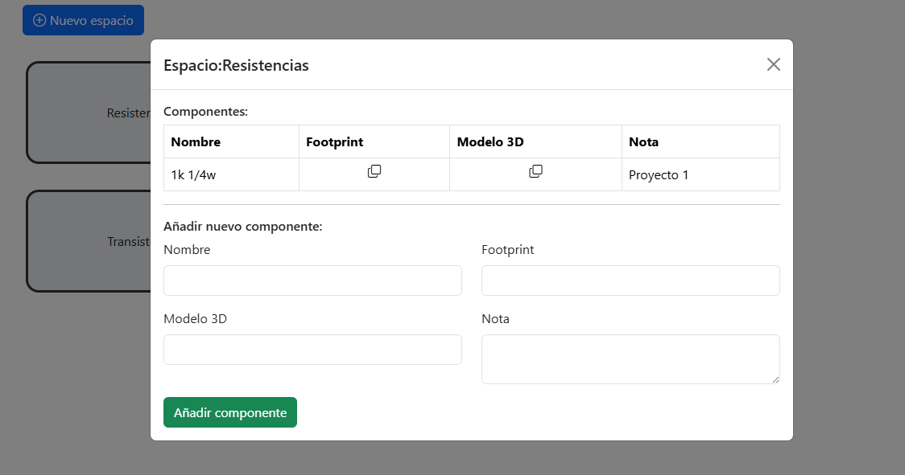

 

# 📂 KiCad Components Organizer

  

Una aplicación web construida con **HTML**, **CSS**, **Bootstrap** y **Vanilla JavaScript** para gestionar de forma sencilla las rutas absolutas de las huellas y modelos 3D de los componentes electrónicos en **KiCad**.  

💡 Esta herramienta surge de la necesidad de **optimizar la búsqueda y reutilización de componentes favoritos** en proyectos de diseño electrónico.

---

## 📑 Tabla de contenidos

- [🚀 Características](#-características)
- [📸 Capturas de pantalla](#-capturas-de-pantalla)
- [🛠️ Tecnologías utilizadas](#️-tecnologías-utilizadas)
- [🌱 Posibles mejoras](#-posibles-mejoras)
- [📖 Más información](#-más-información)
- [👨‍💻 Autor](#-autor)

---

## 🚀 Características

✅ **CRUD completo** para:  
- Crear espacios donde agrupar tus componentes (ej. resistencias, condensadores, etc.).  
- Añadir huellas y modelos 3D asociados a cada componente.  
- Editar y eliminar fácilmente cada elemento.  

✅ Interfaz ligera y responsiva gracias a **Bootstrap**.  
✅ Construido 100% con **Vanilla JS**, sin frameworks externos.  
✅ Perfecto como base para expandirlo a un proyecto más robusto con backend (Node.js, Express, MongoDB).  

---

## 📸 Capturas de pantalla

  

  

---

## 🛠️ Tecnologías utilizadas

- 🌐 **HTML5**  
- 🎨 **CSS3**  
- 🖌️ **Bootstrap 5**  
- ⚡ **JavaScript (DOM Manipulation)**  

---

## 🌱 Posibles mejoras
🔜 En próximas versiones podríamos:

Añadir autenticación de usuarios.

Implementar un backend con base de datos para persistencia.

Desplegar la app en la nube para acceso desde cualquier lugar.

¿Te gustaría colaborar? 👉 Abre un issue o haz un pull request.

## 📖 Más información
📄 En mi blog estoy publicando contenido sobre JavaScript y manipulación del DOM durante todo agosto, además de ejemplos prácticos como esta app.

📹 También puedes ver la demo en [Youtube](https://youtu.be/WDjYXBhGdLg).

---

## 👨‍💻 Autor
👋 Creado por Ale Díaz
🌐 **[Mi página web](https://alediaz.xyz/)**

